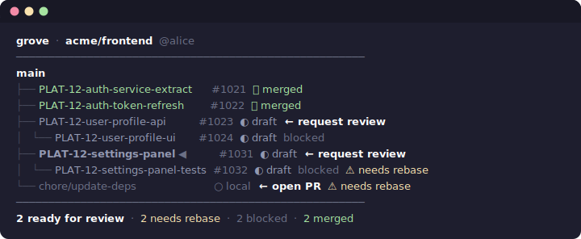

# grove

A local CLI tool that reads your git branches and GitHub PR state to render a
dependency tree of stacked PRs — so you can see at a glance which PR to send
for review next.

GitHub's PR list is flat. Branch names don't tell you the order. Grove fixes that.



## How it works

Grove combines two sources of truth:

- **GitHub PR metadata** — fetched via the GitHub API using your existing `gh` CLI auth. Each PR's `base.ref` (the branch it's targeting) defines the parent-child relationship.
- **Local git state** — used to detect whether a branch needs rebasing (i.e. the parent branch's tip is no longer in the branch's history).

The tree is built from `base.ref` chains. If PR B targets branch A, B is a child of A. If both target `master`, they're siblings. This reflects the actual merge dependency — not just naming conventions.

### Status icons

| Icon | Meaning |
|------|---------|
| ✅   | Merged |
| ●    | Open |
| ◐    | Draft |
| ○    | Local only (no PR yet) |
| ⚠    | Needs rebase |
| ◀    | Your current branch |

### Annotations

| Label | Meaning |
|-------|---------|
| `← request review` | All ancestor PRs are merged — this one is ready |
| `← open PR` | Local branch with no PR yet, ancestors are merged |
| `blocked` | Has at least one unmerged ancestor |
| `⚠ needs rebase` | Parent branch has moved; branch needs rebasing |
| `· not local` | Branch exists on GitHub but isn't checked out locally |

## Installation

**Requirements:** Node.js 18+, [GitHub CLI (`gh`)](https://cli.github.com/) authenticated.

```bash
# Clone and install globally
git clone git@github.com:deviationist/grove.git
cd grove
npm install
npm run build
npm install -g .
```

Then run from anywhere inside a git repository:

```bash
grove
```

## Usage

```
grove [filter] [--all] [--author <login>]
```

### Default — your PRs only

```bash
grove
```

Shows only branches whose PR was authored by you (detected via `gh api user`).
The header shows `@your-login` to confirm the filter is active.

### Filter by keyword

```bash
grove PLAT-12
```

Filters branches by name or PR title (case-insensitive). Works alongside
author filtering.

### Show all authors

```bash
grove --all
```

Disables the author filter — shows every local branch and its PR state.

### Filter by a specific author

```bash
grove --author bob
```

Shows branches whose PRs were opened by `bob`.

### Combine filters

```bash
grove --author bob PLAT-12
```

## Understanding the tree

The dependency tree is built entirely from **GitHub's `base.ref`** — the target
branch of each PR. This is the most reliable source because it reflects the
actual merge order:

- If PR B targets branch A on GitHub → B is shown as a child of A
- If PR B targets `master` → B is a direct child of trunk

This means that if you open all your PRs targeting `master` directly (a common
workflow), grove will show them as siblings even if the branches are git-stacked
on each other. To get a nested tree, the PRs themselves need to target the
previous branch in the stack as their base.

### Needs rebase detection

A branch is flagged `⚠ needs rebase` when `git merge-base(branch, parent)` does
not equal the parent's current tip — meaning the parent has new commits the
branch hasn't incorporated. This check runs in parallel for all branches.

### Remote-only branches

If one of your local PRs targets a branch you don't have checked out locally
(e.g. a shared base branch opened by you on GitHub), grove will automatically
detect it, fetch its PR metadata, and include it as a `· not local` node in
the tree so the stack structure is preserved.

## Tech stack

- **Node.js + TypeScript**, bundled with `esbuild`
- `chalk` — terminal colours
- GitHub REST API via `fetch` + `gh auth token` for authentication
- No TUI framework — plain stdout rendering

## Zero config

Grove detects everything from your environment:

- **Repo** — parsed from `git remote get-url origin`
- **Trunk** — auto-detected (`main`, `master`, or `develop`)
- **Auth** — uses your existing `gh` CLI session, no new login required
- **Current branch** — highlighted with `◀`

No config files, no telemetry, no third-party services.
